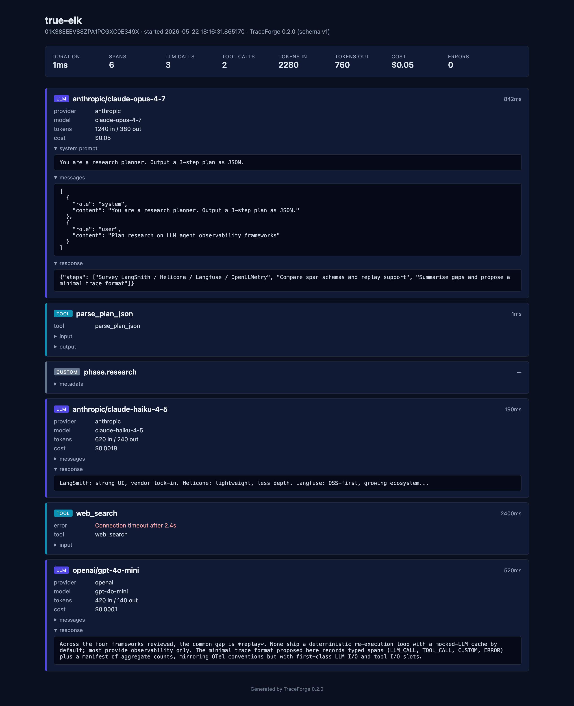
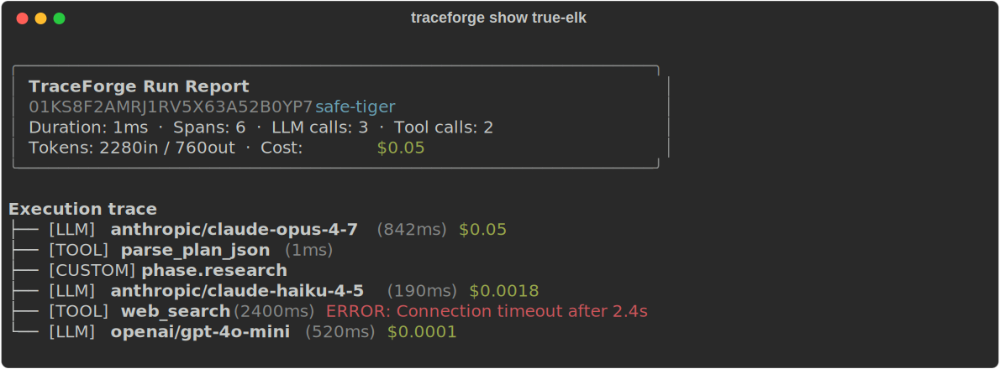

# TraceForge

**Agent runtime tracing + LLM-mock replay for Python. Pip install. Async-first. Self-contained reports.**

[](https://pypi.org/project/agentrace-llm/)
[](https://pypi.org/project/agentrace-llm/)
[](LICENSE)
[](https://github.com/Danultimate/agentrace-llm/actions/workflows/ci.yml)
[](#replay)



> ⚠️ **Pre-release (v0.2).** Tracer, replay, instrumentors, cost tracking, and the pytest plugin are implemented end-to-end and tested. APIs are stabilising — don't depend on this in production yet.

TraceForge records every LLM call, tool invocation, error, and state transition your agent makes into a typed span. The output is a replayable `run.jsonl` artifact plus a self-contained HTML report you can open in any browser — no server, no SaaS, no SDK lock-in. Replay mode re-executes the agent with cached LLM responses (or cached tool outputs) so you can verify the execution path without burning API calls.

```bash
pip install "agentrace-llm[anthropic]"   # or [openai], [all]
traceforge init && python agent.py
```

---

## Why TraceForge

| | TraceForge | [LangSmith](https://smith.langchain.com/) | [Langfuse](https://langfuse.com/) | [OpenLLMetry](https://github.com/traceloop/openllmetry) | `print()` |
|---|:---:|:---:|:---:|:---:|:---:|
| Pip install, no account, no server                 | ✅ | — | partial (self-host) | ✅ | ✅ |
| Records LLM I/O + tool I/O + state per span        | ✅ | ✅ | ✅ | partial | — |
| **Replay with cached LLM responses (`llm-mock`)**  | ✅ | — | — | — | — |
| **Dry-run replay with cached tool outputs**        | ✅ | — | — | — | — |
| Self-contained HTML report (no CDN, no server)     | ✅ | — | — | — | — |
| Auto-cost tracking per-span + per-run              | ✅ | ✅ | ✅ | partial | — |
| First-class pytest plugin with snapshot testing    | ✅ | — | — | — | — |
| Auto-patches your SDK clients                      | opt-in | ✅ | ✅ | ✅ | n/a |
| Cloud storage / hosted dashboard                   | — | ✅ | ✅ | via vendor | — |

**Where TraceForge fits:** when you need a *local, file-based, replayable* record of what your agent did — for debugging, CI regression tests, or post-hoc analysis — without sending your traces to anyone else's database. Auto-patching frameworks like LangSmith give you a UI; OpenLLMetry gives you OTel pipes. TraceForge gives you a JSONL you can `git diff`, an HTML you can email, and a `tracer.replay()` you can run offline.

---

## 60-second quickstart

**1. Install and scaffold.**

```bash
pip install "agentrace-llm[anthropic]"
traceforge init
```

`traceforge init` writes `traceforge.yaml`, a working `agent.py` example, and a `.gitignore` entry.

**2. Wrap your agent.**

```python
import asyncio
from anthropic import AsyncAnthropic
from traceforge import Tracer
from traceforge.integrations.anthropic import AnthropicInstrumentor

tracer = Tracer()

async def main():
    async with tracer.run() as run:
        client = AnthropicInstrumentor(run).instrument(AsyncAnthropic())
        response = await client.messages.create(
            model="claude-haiku-4-5-20251001",
            max_tokens=256,
            messages=[{"role": "user", "content": "What is 2 + 2?"}],
        )
        print(response.content[0].text)
    run.trace.print_summary()

asyncio.run(main())
```

**3. Run.**

```bash
export ANTHROPIC_API_KEY=sk-ant-...
python agent.py
```

You get a Rich-formatted summary on stdout, plus a directory at `.traceforge/runs/<ulid>-<run-name>/` containing `manifest.json`, `run.jsonl`, and a self-contained `report.html`.

<details>
<summary><b>Library-only API (no instrumentor)</b></summary>

```python
async with tracer.run() as run:
    run.record_llm_call(
        provider="anthropic",
        model="claude-haiku-4-5",
        messages=[...],
        response="...",
        input_tokens=12, output_tokens=4, latency_ms=180,
    )
    run.record_tool_call("search", tool_input={"q": "..."}, tool_output={"hits": 3})
    run.custom("phase.done", metadata={"step": 1})

run.trace.print_summary()
```

Manual recording is the lower-level API the instrumentors are built on. Useful when you don't want TraceForge anywhere near the SDK call.
</details>

<details>
<summary><b>Decorator sugar</b></summary>

```python
@tracer.trace
async def my_agent(query, _run=None):
    _run.record_tool_call("search", {"q": query}, {"hits": 3})
    return "done"

await my_agent("hello")        # auto-saves trace to .traceforge/runs/
trace = tracer.last()
```
</details>

---

## Reports

`tracer.run()` writes three files per run to `.traceforge/runs/<ulid>-<run-name>/`:

```
.traceforge/runs/01KS8E...-true-elk/
├── report.html      ← open this
├── run.jsonl        ← replayable artifact (one span per line + manifest)
└── manifest.json    ← aggregate counts + cost + token totals
```

**Terminal:** `run.trace.print_summary()` prints a Rich panel + span tree:



**HTML:** self-contained, dark theme, no CDN. Open `report.html` in any browser (or via `traceforge open <run-name>`):

- **Stat strip** at the top: duration, span count, LLM calls, tool calls, token totals, **cost**, errors
- **Span cards** with type-coded left border (indigo LLM, cyan tool, slate custom, **red errors**)
- **Collapsible payloads** for system prompts, message arrays, and tool I/O — kept folded by default so the page stays scannable
- **Per-span cost** rendered inline for every LLM call

A live example sits at [`docs/example-report.html`](docs/example-report.html) — open it directly to see the layout.

---

## Replay

```python
# llm-mock: LLM responses served from cache, tools execute live
result = await tracer.replay(trace, agent_fn, mode="llm-mock")

# dry-run: both LLM responses AND tool outputs served from cache, no network
result = await tracer.replay(trace, agent_fn, mode="dry-run")

result.print()
# Similarity: 100%  ·  Status: ALIGNED
```

The replay engine builds two interceptors keyed by SHA-256 of the original messages / tool inputs, and hands them to your agent function. Your agent consults the interceptor before calling out:

```python
async def my_agent(query, _run=None, _mock_llm=None, _mock_tool=None):
    cached = _mock_llm.get(messages) if _mock_llm else None
    if cached is not None:
        return cached
    return await client.messages.create(...)
```

The shipped instrumentors handle this for you — just pass `mock_interceptor=_mock_llm` when instrumenting:

```python
client = AnthropicInstrumentor(_run, mock_interceptor=_mock_llm).instrument(AsyncAnthropic())
```

**Similarity scoring.** `ReplayResult.similarity_score` is the ratio of matching span types between original and replayed traces. Below 0.4 the replay is marked `DIVERGED`. See [`docs/replay-faq.md`](docs/replay-faq.md) for why replays diverge and how to fix it.

---

## Cost tracking

Every LLM span gets a USD cost estimate attached automatically, looked up from a built-in pricing table for the major Anthropic and OpenAI models (with longest-prefix matching, so versioned IDs like `claude-haiku-4-5-20251001` resolve correctly). Aggregates flow into `manifest.total_cost_usd`.

```python
async with tracer.run() as run:
    await client.messages.create(...)  # instrumentor records cost

print(run.trace.manifest.total_cost_usd)  # → 0.0042
```

Override the table for negotiated contract pricing or private models:

```python
from traceforge import Tracer
from traceforge.pricing import ModelPrice

tracer = Tracer(pricing={
    "my-internal-model": ModelPrice(input_per_million=0.5, output_per_million=1.5),
    "claude-opus-4-7":   ModelPrice(input_per_million=12.0, output_per_million=60.0),
})
```

Unknown models cost 0 and emit a one-shot warning so the trace still saves.

---

## Pytest plugin

`pip install agentrace-llm` auto-registers a pytest plugin (via `pytest11` entry point). Three fixtures appear in any test suite:

```python
import pytest

@pytest.mark.asyncio
async def test_agent_runs_under_budget(tracer, tf_assert, tf_snapshot):
    async with tracer.run() as run:
        await my_agent("hello", _run=run)

    tf_assert(
        run.trace,
        has_span="search",
        llm_calls=1,
        max_cost_usd=0.01,
        max_tokens=2000,
    )

    # Golden-trace snapshot — fails if the span-type sequence drifts.
    tf_snapshot.assert_match(run.trace, "agent_v1")
```

| Fixture | What it gives you |
|---|---|
| `tracer` | A non-auto-saving `Tracer` per test (no `.traceforge/` cruft) |
| `tf_assert(trace, ...)` | One-line common assertions: `has_span`, `has_span_type`, `no_errors`, `llm_calls`, `tool_calls`, `max_cost_usd`, `max_tokens`, `min_spans` |
| `tf_snapshot.assert_match(trace, name)` | Records the trace on first run, then asserts span-type-sequence similarity ≥ 0.8 on every subsequent run |

Snapshots live in `tests/__tf_snapshots__/<name>.jsonl` by default — override with `--tf-snapshot-dir`. Commit them like you commit any other golden file. Refresh after intentional changes with:

```bash
pytest --tf-update-snapshots
```

---

## Instrumentors

| Provider | Class | Wraps |
|---|---|---|
| Anthropic | `traceforge.integrations.anthropic.AnthropicInstrumentor` | `client.messages.create` |
| OpenAI    | `traceforge.integrations.openai.OpenAIInstrumentor`       | `client.chat.completions.create` |
| LangChain | `traceforge.integrations.langchain.LangChainInstrumentor` | manual `record_chain_step` / `record_llm_step` |

LangChain is intentionally manual — auto-patching is fragile across versions, so TraceForge ships a bridge helper you call from your callback handler.

---

## CLI

| Command | Purpose |
|---|---|
| `traceforge init` | Scaffold `traceforge.yaml`, `agent.py` example, `.gitignore` entry |
| `traceforge list` | Table of local runs (newest first) |
| `traceforge open <id>` | Open a run's HTML report in your browser |
| `traceforge show <id>` | Print a run summary to the terminal |

`<id>` accepts a ULID prefix *or* the human-readable run name (`brave-salmon`).

---

## Non-goals

- **No auto-patching by default.** Instrumentors are opt-in. Your code stays explicit about what's being traced.
- **No time-travel debugging.** TraceForge records and replays; it does not pause your agent mid-flight.
- **No cloud storage.** Traces live in `.traceforge/runs/`. Bring your own object store if you want central retention.
- **No built-in eval scoring.** TraceForge captures the run; pair it with `evalkit` (or your own scorer) for grading.

---

## Status

| Feature | Status |
|---|---|
| Async + sync context manager, `@tracer.trace` decorator | ✅ shipped |
| Anthropic / OpenAI instrumentors | ✅ shipped |
| LangChain bridge (manual) | ✅ shipped |
| File store: `manifest.json` + `run.jsonl` + `report.html` | ✅ shipped |
| Self-contained HTML report (no CDN) | ✅ shipped |
| LLM-mock replay | ✅ shipped |
| Dry-run replay (tool cache) | ✅ shipped |
| Cost tracking (per-span + manifest total) | ✅ shipped (v0.2) |
| Custom pricing tables | ✅ shipped (v0.2) |
| Pytest plugin (`tracer`, `tf_assert`) | ✅ shipped (v0.2) |
| Trace snapshot testing (`tf_snapshot`) | ✅ shipped (v0.2) |
| Streaming + tool-use in instrumentors | deferred |
| `traceforge diff` (span-level diff) | deferred |
| Slim mode (`--slim`) | deferred |
| LangGraph auto-instrumentation | manual only |
| Cloud storage backends | non-goal |

Track progress and propose features via [GitHub Issues](https://github.com/Danultimate/agentrace-llm/issues).

---

## Docs

- [Replay FAQ](docs/replay-faq.md) — why replays diverge, and how to fix it
- [Example HTML report](docs/example-report.html) — live, self-contained

## License

[Apache 2.0](LICENSE).
